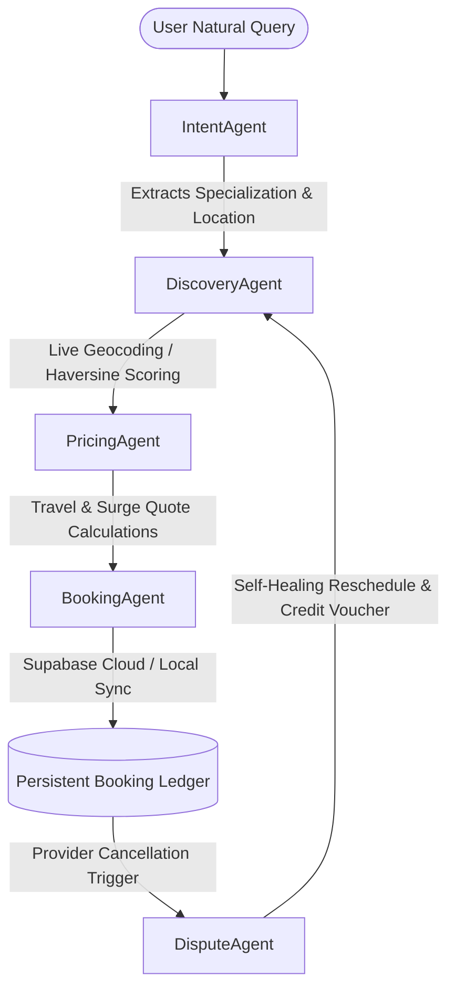

# Phase 5 — Deep Analysis: `hamara-rozgar`

**Slug:** 03_hamara_rozgar  
**Local path:** `/home/z/my-project/repos/hamara-rozgar`

## 1. High-Level Snapshot

- **Total files (excluding node_modules/.git):** 86
- **Total source lines (non-empty):** 5,142
- **Source : Config ratio:** 3.25 (higher = more code-driven)
- **Docs : Source ratio:** 0.077

## 2. Language Breakdown (by file count)

| Language | Files |
|---|---|
| Other | 64 |
| JavaScript | 6 |
| JSON | 3 |
| Java | 3 |
| HTML | 2 |
| JavaScript (React) | 2 |
| CSS | 2 |
| Markdown | 1 |
| Env | 1 |
| Shell | 1 |
| Python | 1 |

## 3. Lines of Code by Language (source only)

| Language | Lines |
|---|---|
| CSS | 1,700 |
| JavaScript | 1,229 |
| JavaScript (React) | 1,158 |
| Python | 777 |
| HTML | 275 |
| Java | 3 |

## 4. File Categories

| Category | Files |
|---|---|
| docs | 1 |
| other | 64 |
| config | 4 |
| script | 1 |
| source | 13 |
| test | 3 |

## 5. Frameworks Detected

- React ^19.2.6

## 6. Key Libraries Detected

- lucide-react icons
- Vite ^8.0.12
- ESLint

## 7. Directory Structure (depth ≤ 2)

```
./
  .env.example
  .gitignore
  Antigravity_Trace_Logs.zip
  Hamara_Rozgar.apk
  Hamara_Rozgar_Documentation.pdf
  Hamara_Rozgar_Signed.apk
  README.md
  build_apk.bat
  build_apk.sh
  capacitor.config.json
  documentation.html
  eslint.config.js
  index.html
  package-lock.json
  package.json
  ... +1 more files
  android/
    .gitignore
    build.gradle
    capacitor.settings.gradle
    gradle.properties
    gradlew
    gradlew.bat
    settings.gradle
    variables.gradle
    app/
    gradle/
  maps-scrape/
    hamara_rozgar_scraper.py
    scraped_providers.csv
    scraper.progress
    twin_cities_grid.csv
  public/
    favicon.svg
    icons.svg
  scratch/
    test_parse.js
  src/
    App.css
    App.jsx
    firebase.js
    index.css
    main.jsx
    agents/
    assets/
    data/
```

## 8. Key Config Files Found

- `README.md` → `README.md`
- `package.json` → `package.json`
- `package-lock.json` → `package-lock.json`
- `vite.config.js` → `vite.config.js`
- `.env.example` → `.env.example`

## 9. package.json (if present)

- **Name:** service-orchestrator
- **Version:** 0.0.0
- **Private:** True
- **Type:** module

### Scripts

| Script | Command |
|---|---|
| `dev` | `vite` |
| `build` | `vite build` |
| `lint` | `eslint .` |
| `preview` | `vite preview` |

### Dependencies (top 20)

| Package | Version |
|---|---|
| `@capacitor/android` | `^8.3.4` |
| `@capacitor/core` | `^8.3.4` |
| `lucide-react` | `^1.16.0` |
| `react` | `^19.2.6` |
| `react-dom` | `^19.2.6` |

### Dev Dependencies (top 20)

| Package | Version |
|---|---|
| `@capacitor/cli` | `^8.3.4` |
| `@eslint/js` | `^10.0.1` |
| `@types/react` | `^19.2.14` |
| `@types/react-dom` | `^19.2.3` |
| `@vitejs/plugin-react` | `^6.0.1` |
| `eslint` | `^10.3.0` |
| `eslint-plugin-react-hooks` | `^7.1.1` |
| `eslint-plugin-react-refresh` | `^0.5.2` |
| `globals` | `^17.6.0` |
| `vite` | `^8.0.12` |

## 10. README Excerpt (first 3000 chars)

```markdown
# Hamara-Rozgar (RozgarOrch) 🛠️
### Challenge 2: AI Service Orchestrator for Informal Economy - Google Antigravity Hackathon

**Hamara-Rozgar (RozgarOrch)** is a premium, agentic, AI-driven marketplace orchestrator designed to solve fragmentation in Pakistan's informal economy. By bridging the digital divide for daily wage workers (plumbers, electricians, tutors, AC technicians, beauticians, mechanics), this solution automates the end-to-end booking lifecycle. It parses multi-turn conversational queries across Urdu, Roman Urdu, and English, executes proximity matching, performs travel-adjusted pricing, registers persistent transactions, and resolves real-time anomalies.

The project is **100% Evacuated from Google Cloud**, running fully offline and using open-source/self-hosted equivalents (OSM, Supabase, Ollama, Groq, GitHub Models) inside a beautiful **Widescreen Native Web Dashboard** featuring a **Chronological Agentic Execution Timeline**.

---

## 🏛️ System Architecture

Our solution is built on a **Decoupled Multi-Agent Cooperative Pipeline**. Rather than a monolithic model, tasks are delegated to specialized micro-agents that communicate parameters sequentially and react dynamically to operational state updates:



### The 5 Cooperative micro-agents:
1. **IntentAgent (Multilingual Parsing & Context Memory)**:
   * Extracts target specialization and location parameters across English, formal Urdu script, and colloquial Roman Urdu slang (e.g., *"yar AC kaam nahi kr rha thanda"*).
   * Fully integrates multiple selectable LLM parsing engines:
     - **Local Slang Parser (Regex)**: Ultra-fast offline dictionary fallback.
     - **Ollama**: Private, self-hosted offline LLM intent parsing.
     - **Groq Cloud API**: Free-tier Open LLM intent parsing.
     - **GitHub Models API**: High-fidelity intent parsing.
     - **Auto-Failover**: If Groq API fails or is rate-limited, it automatically fails over to the GitHub Models API (if configured) before resorting to regex.
   * Maintains multi-turn context memory across conversation history.

2. **DiscoveryAgent (Proximity & Workload Optimizer)**:
   * Connects directly to browser GPS Geolocation coordinates on startup.
   * If a custom location or landmark is specified, it queries the **OpenStreetMap Nominatim API** (free & open-source) to geocode precise coordinates.
   * Scores and ranks matching specialists using a **6-Factor Utility Function**:
     $$\text{Utility} = (d \times 0.25) + (R \times 0.20) + (L \times 0.20) + 
```

## 11. Engineering Rigor Signals

- **Has tests:** True (3 test files)
  - Test files:
    - `scratch/test_parse.js`
    - `android/app/src/androidTest/java/com/getcapacitor/myapp/ExampleInstrumentedTest.java`
    - `android/app/src/test/java/com/getcapacitor/myapp/ExampleUnitTest.java`
- **Has CI:** False
- **Has Docker:** False
- **Env files:** ['.env.example']

## 12. Largest Files (top 10 — bloat / asset check)

| File | Size |
|---|---|
| `Hamara_Rozgar_Signed.apk` | 3.20 MB |
| `Hamara_Rozgar.apk` | 3.16 MB |
| `maps-scrape/scraped_providers.csv` | 2.19 MB |
| `Antigravity_Trace_Logs.zip` | 223.9 KB |
| `package-lock.json` | 116.2 KB |
| `src/App.jsx` | 55.5 KB |
| `src/agents/Orchestrator.js` | 54.4 KB |
| `android/gradle/wrapper/gradle-wrapper.jar` | 42.7 KB |
| `maps-scrape/hamara_rozgar_scraper.py` | 41.7 KB |
| `src/index.css` | 34.2 KB |

## 13. Commit History

- **Commits available (in shallow clone):** 100
- **First commit date (in clone):** 2026-05-27
- **Last commit date:** 2026-06-28
- **Contributors:** {'github-actions[bot]': 100}

### Recent Commits (last 30)

| Hash | Date | Subject |
|---|---|---|
| `ded3a8b` | 2026-06-28 | chore: incremental update of scraped local businesses & progress |
| `e127133` | 2026-06-28 | chore: incremental update of scraped local businesses & progress |
| `6d18e78` | 2026-06-27 | chore: incremental update of scraped local businesses & progress |
| `0575ba2` | 2026-06-27 | chore: incremental update of scraped local businesses & progress |
| `9aee77f` | 2026-06-27 | chore: incremental update of scraped local businesses & progress |
| `2b5118a` | 2026-06-27 | chore: incremental update of scraped local businesses & progress |
| `c005476` | 2026-06-26 | chore: incremental update of scraped local businesses & progress |
| `25b11d7` | 2026-06-26 | chore: incremental update of scraped local businesses & progress |
| `ca510db` | 2026-06-26 | chore: incremental update of scraped local businesses & progress |
| `39ac9c0` | 2026-06-25 | chore: incremental update of scraped local businesses & progress |
| `8e50867` | 2026-06-25 | chore: incremental update of scraped local businesses & progress |
| `e9b58a9` | 2026-06-25 | chore: incremental update of scraped local businesses & progress |
| `71d2ff5` | 2026-06-24 | chore: incremental update of scraped local businesses & progress |
| `f00322f` | 2026-06-24 | chore: incremental update of scraped local businesses & progress |
| `5da3af7` | 2026-06-23 | chore: incremental update of scraped local businesses & progress |
| `5cc45ae` | 2026-06-23 | chore: incremental update of scraped local businesses & progress |
| `3c96356` | 2026-06-23 | chore: incremental update of scraped local businesses & progress |
| `5bd6ce8` | 2026-06-23 | chore: incremental update of scraped local businesses & progress |
| `fb657e0` | 2026-06-22 | chore: incremental update of scraped local businesses & progress |
| `24d0569` | 2026-06-22 | chore: incremental update of scraped local businesses & progress |
| `3651893` | 2026-06-22 | chore: incremental update of scraped local businesses & progress |
| `611e08c` | 2026-06-21 | chore: incremental update of scraped local businesses & progress |
| `2056c7a` | 2026-06-21 | chore: incremental update of scraped local businesses & progress |
| `d6a8284` | 2026-06-21 | chore: incremental update of scraped local businesses & progress |
| `8af422d` | 2026-06-20 | chore: incremental update of scraped local businesses & progress |
| `806a23e` | 2026-06-20 | chore: incremental update of scraped local businesses & progress |
| `aad5348` | 2026-06-20 | chore: incremental update of scraped local businesses & progress |
| `fefa312` | 2026-06-19 | chore: incremental update of scraped local businesses & progress |
| `973ca16` | 2026-06-19 | chore: incremental update of scraped local businesses & progress |
| `9364d13` | 2026-06-19 | chore: incremental update of scraped local businesses & progress |

## 14. Observations

- Has lint script (code quality discipline).
- Has build script.
- Has dev script.
- Has 3 test file(s) — testing discipline present.
- No CI detected.
- No Dockerfile (acceptable for frontend-focused repos).
- Provides .env.example — good DX practice.
- No LICENSE file (fine for personal projects, matters for OSS positioning).
- README length: 8062 chars. Badges: False. Screenshots: False. Install section: True. Architecture section: True.
